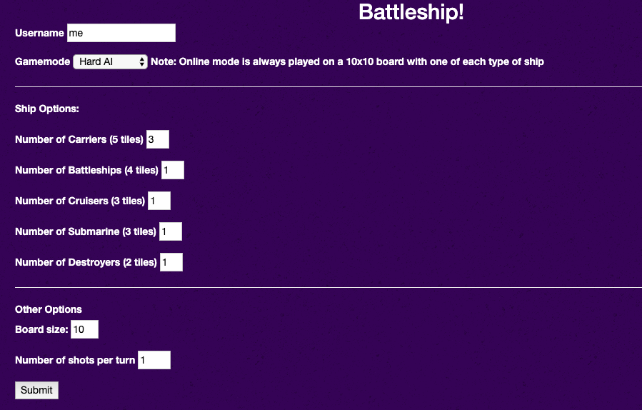
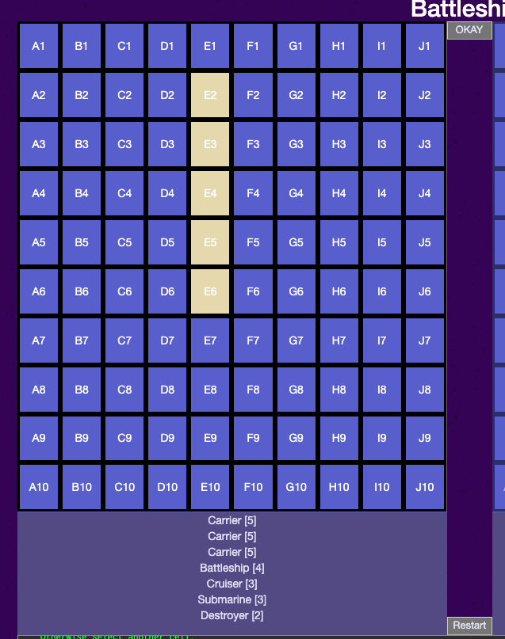
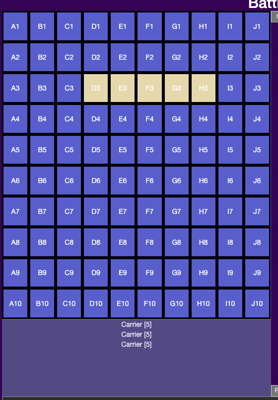
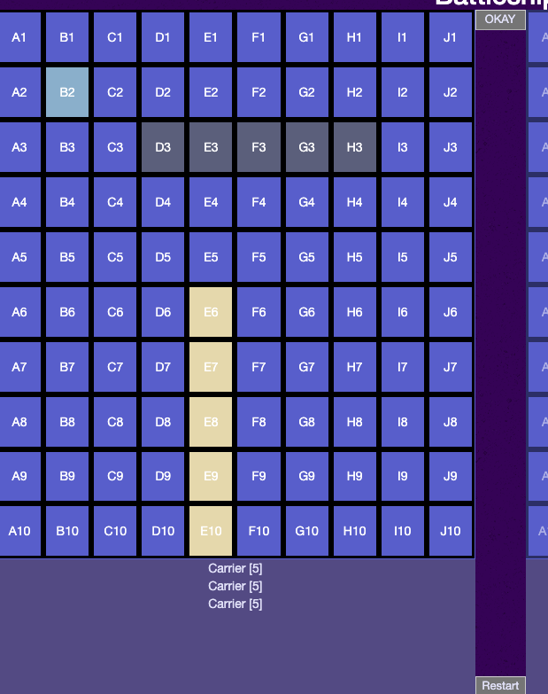
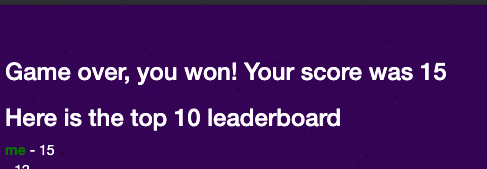

# Battleship

## Description
Battleship is an in-browser battleship game using HTML, CSS, Javascript, and JQuery. A basic AI is provided to play against.
Rules for battleship are found [here](https://www.cs.nmsu.edu/~bdu/TA/487/brules.htm)

## Getting Started
- For multiplayer mode, run NPM start from the root directory. Make sure port 3000 is available, otherwise you must modify the port number in both the server and main.js for all clients.
- Open index.html in a browser to get started.

## Multiplayer instructions
- Multiplayer mode currently only supports two clients at a time that can connect to a common server. 

## Options

- In the options screen you can select your username and select the number of each type of ship, the number of moves per turn, the difficulty of the AI (or select online mode)

## Placement phase
During this phase of the game you are placing your ships. The order of ship placement is in a pre-defined order from largest ship to smallest. 

Click on a tile to place a ship that starts on that tile. Ships will either be placed vertically with the user-selected tile at the top or horizontally with the user selected tile on the left. You will not be able to place a tile if the ship is too large to fit either vertically or horizontally. 

Click the same tile again to rotate it (if it is possible to rotate). At any time before locking you may change your selection by clicking on another tile. 

Press the lock button to lock that ships placement, the color will change. Continue placing ships until all the ships have been exhausted.

## Playing phase
Select a square on the opponents board to be able to make a guess. The console will display whether there was a hit or miss and a visual indicator will show any tiles that have already been selected. The AI will make a move immediately after any player move. The game is over once all ships have been sunk.

## AI Explanation
Easy mode: In easy mode the AI will randomly guess tiles (never repeating guesses already made)

Hard mode: In hard mode the AI will guess every other tile in a checkerboard pattern. After hitting, it will search around the hit for another hit. It will then proceed in a straight line to try and destroy the battleship. If a ship is not destroyed using the strategy, the AI will assume there are multiple ships in the area and will backtrack moves and try to destroy every ship in the region. 

## Scoring

The local highscore is being tracked (tied to the browser) using the username provided in the options screen. The score is calculated as follows: (Number of enemy ship pieces destroyed) - (Number of player ship pieces left). If a score is negative (i.e. the player lost the game) a score of zero will be assigned instead. Note: If you would like an accurate leaderboard keep the number of ships and boardsize constant (otherwise there is a potential of scoring more points when there are more ships).

## Dependencies
- JQuery (imported using CDN)
- Bootstrap (for styling)

## Known bugs/Issues
- During replays, the ship log is sometimes inaccurate.
- Server will sometimes not register a move, causing both clients to be unable to make moves. A server restart and a restart of both clients is required in these instances
- Server needs to be restarted between each game instance.

## Future Features
- Improved server-side features (establishing connection, timeouts)
- Timed moves in multiplayer mode
- Support more players for multiplayer mode
- Save accounts
- Revamped scoring system that involves time played against AI
- Server-side, persistent database for highscores (currently only local high-scores against AI is enabled)
